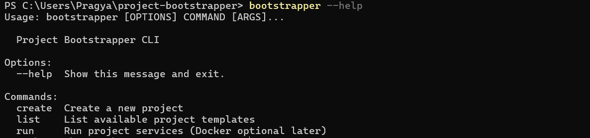

# Project Bootstrapper CLI

CLI tool to scaffold Python and JS backend and React frontend projects, with optional Docker support.

1. We’ll use click, because it’s industry-standard for multi-command tools, and has excellent help and flag handling out of the box. 
2. click builds the help system automatically from your command names, arguments, and docstrings. That’s why --help can exist without extra code.
